OKAPI
=====
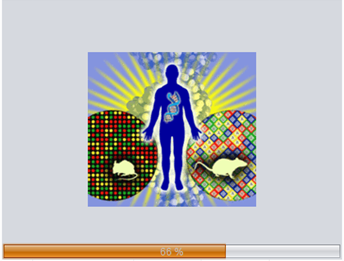

Okapi is a GUI omics data mining toolkit. 

Features:
- Import/export data file
- Two-way analysis
- Network analysis
- R connector

Getting started
=====

See more in https://github.com/nhtuong/okapi/wiki

Screenshots
=====

Import data:

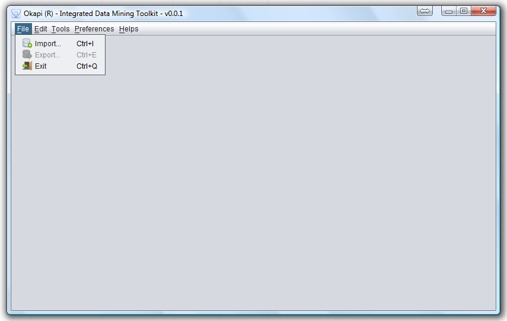

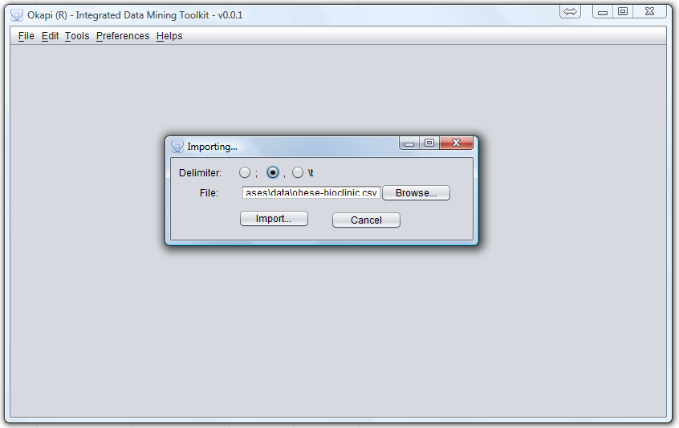

#### Edit data:

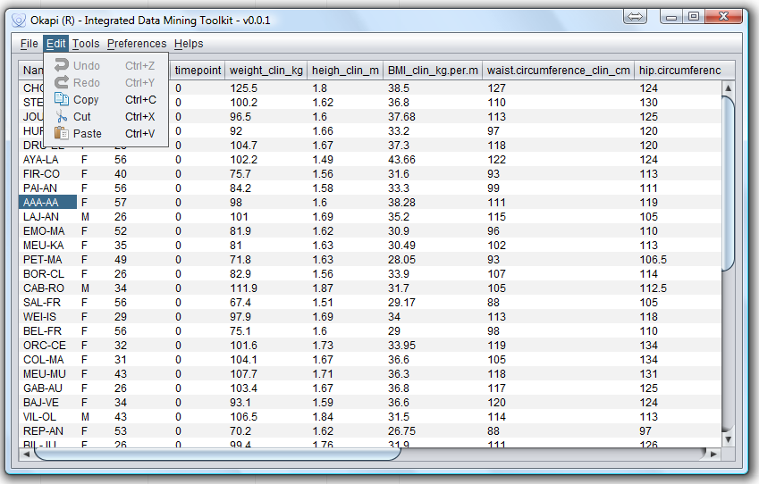

#### Export data:

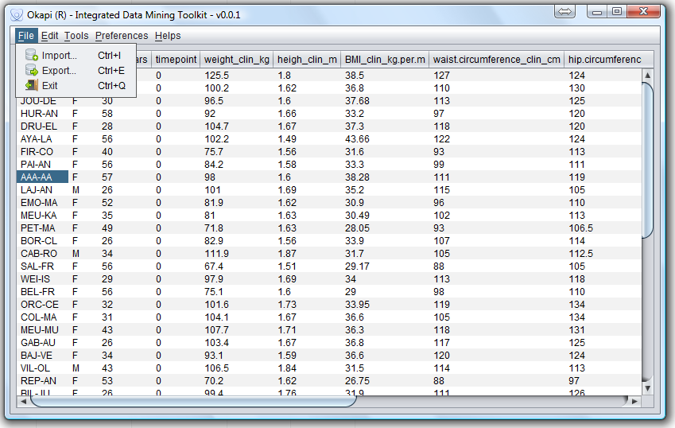
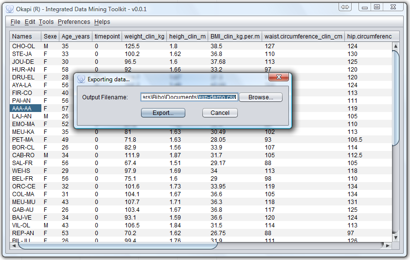

#### Correlation:

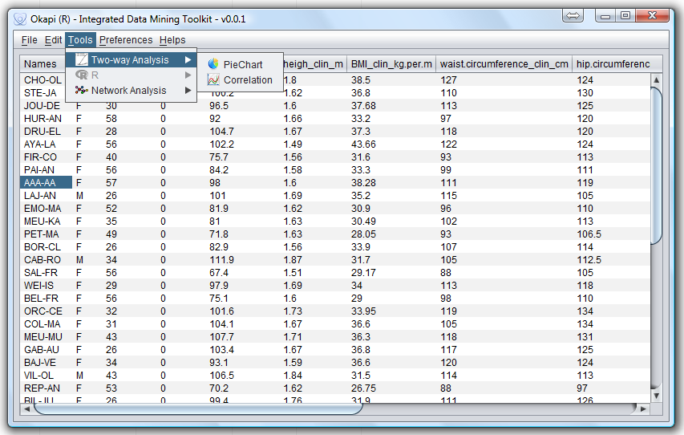

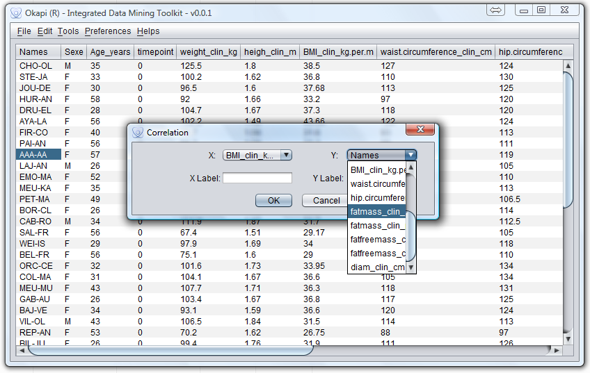

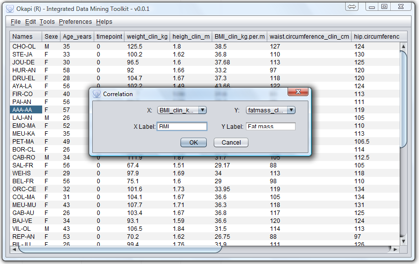

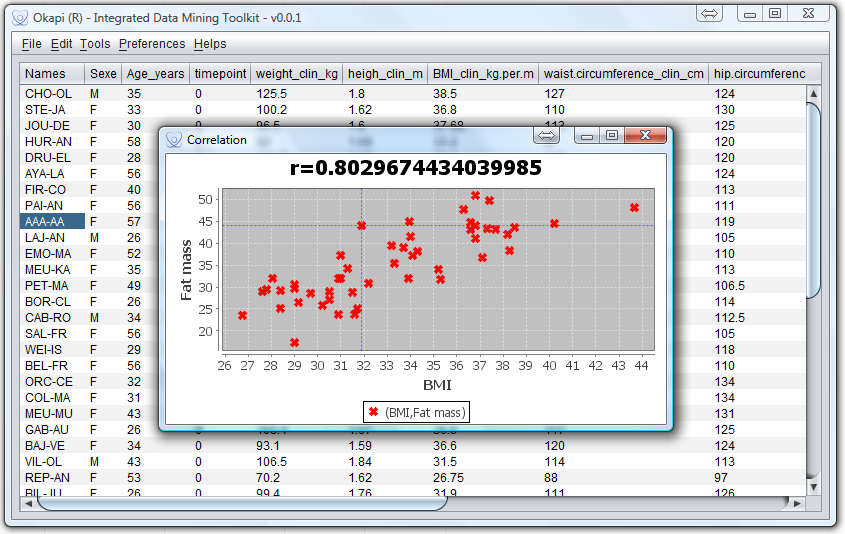

#### R Connector:

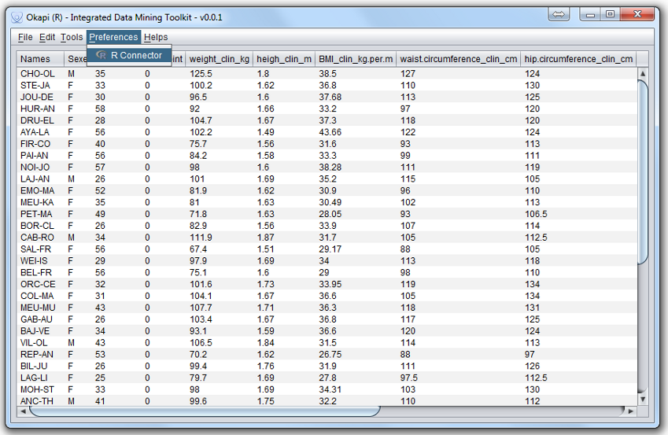

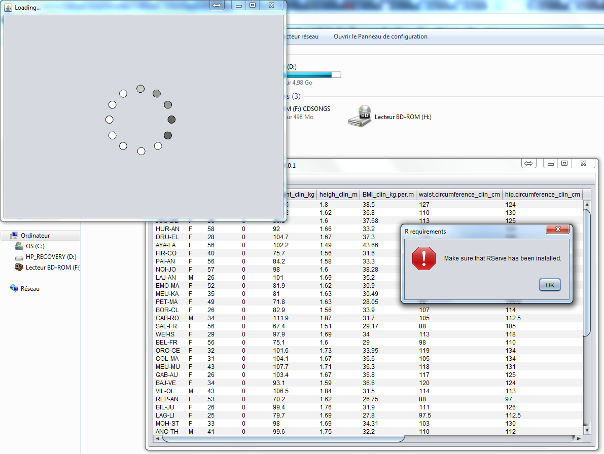

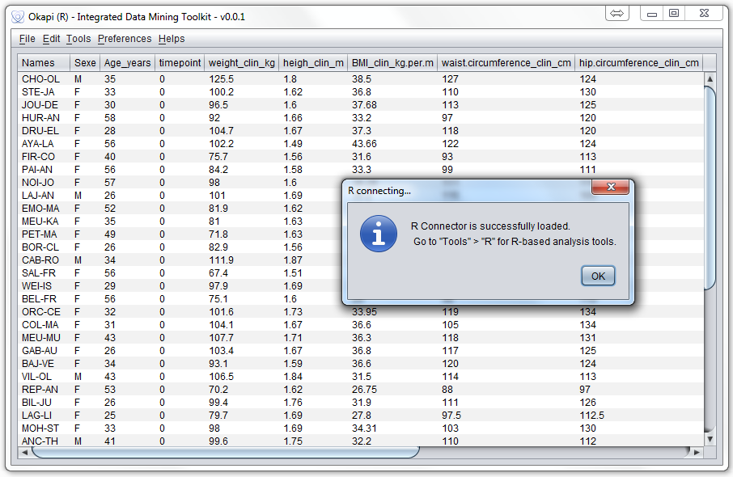

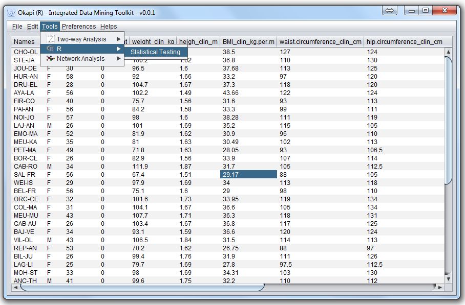

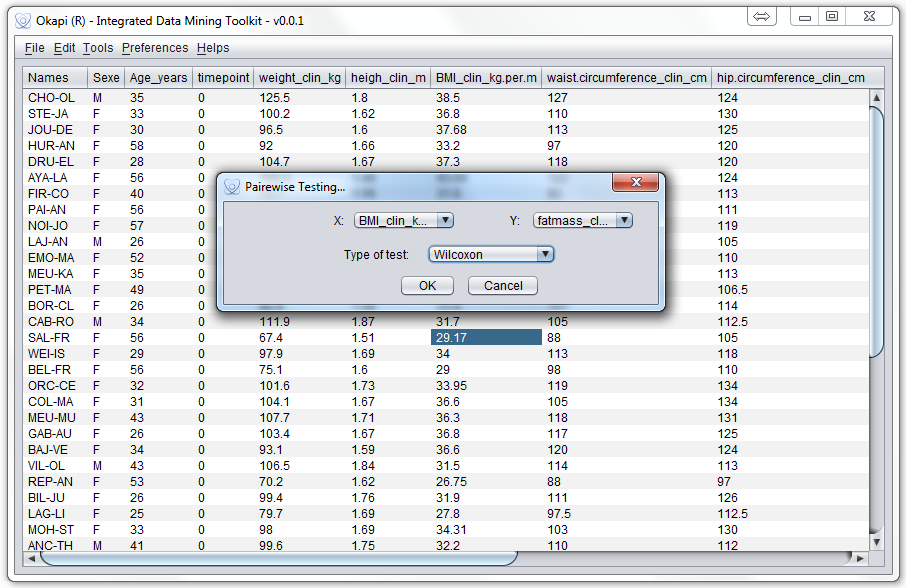

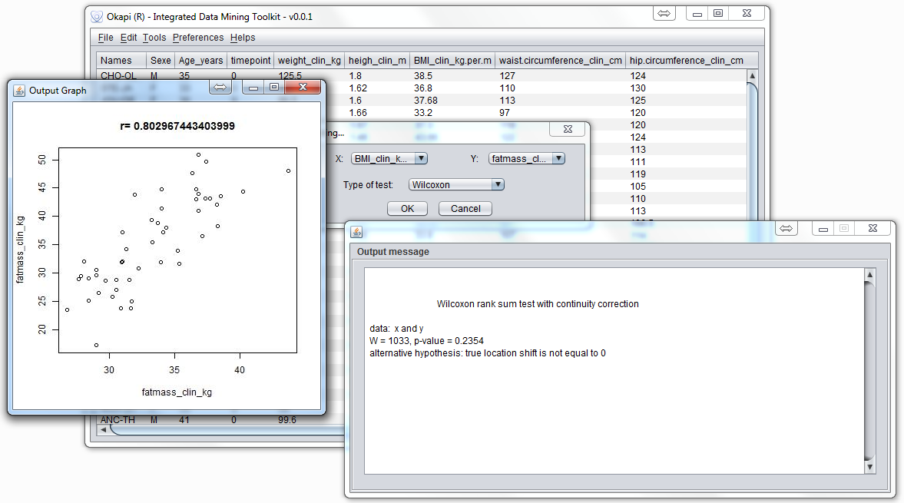

